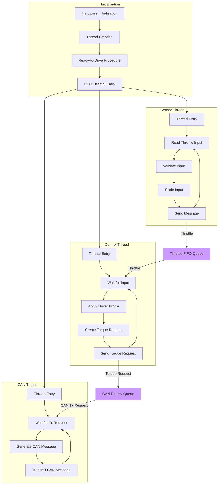

# VCU - Vehicle Control Unit
The VCU is responsible for taking driver throttle inputs and communicating with the inverter.

## System Outline

## Useful Resources

Documentation:
- [VCU Wiki](https://github.com/sufst/vcu/wiki)
- [SUFST Docs Site](https://docs.sufst.co.uk/en/latest/)

Microcontroller:
- [STM32H723ZG MCU Datasheet](https://www.st.com/resource/en/datasheet/stm32h723vg.pdf)
- [STM32H7 Nucleo 144 Dev Board User Manual](https://www.st.com/resource/en/user_manual/dm00499160-stm32h7-nucleo144-boards-mb1364-stmicroelectronics.pdf)
- [STM32H7xx HAL Manual](https://www.st.com/resource/en/user_manual/um2217-description-of-stm32h7-hal-and-lowlayer-drivers-stmicroelectronics.pdf)

ThreadX RTOS:
- [ThreadX Overview](https://docs.microsoft.com/en-us/azure/rtos/threadx/overview-threadx)
- [ThreadX API](https://docs.microsoft.com/en-us/azure/rtos/threadx/chapter4)

## Related Projects

- [VCU Driver Profiles App](https://github.com/sufst/vcu-driver-profile)
- [VCU Breakout Board](https://github.com/sufst/vcu-breakout)
