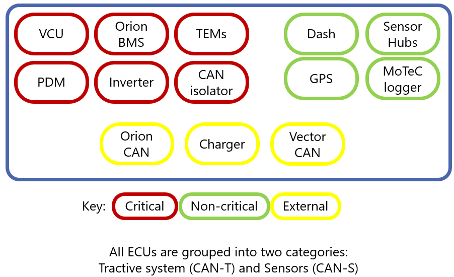
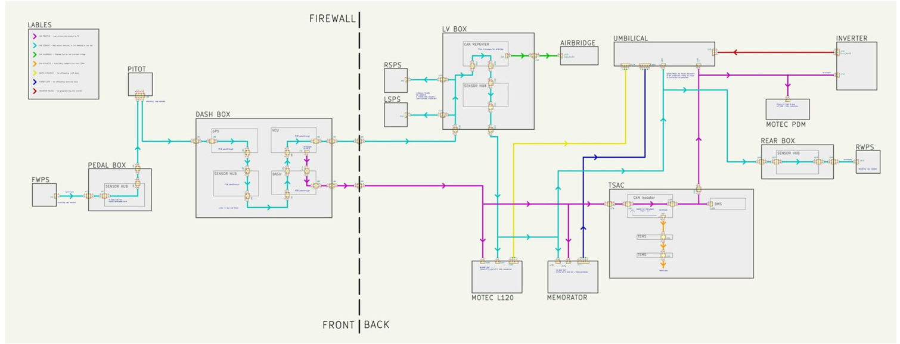
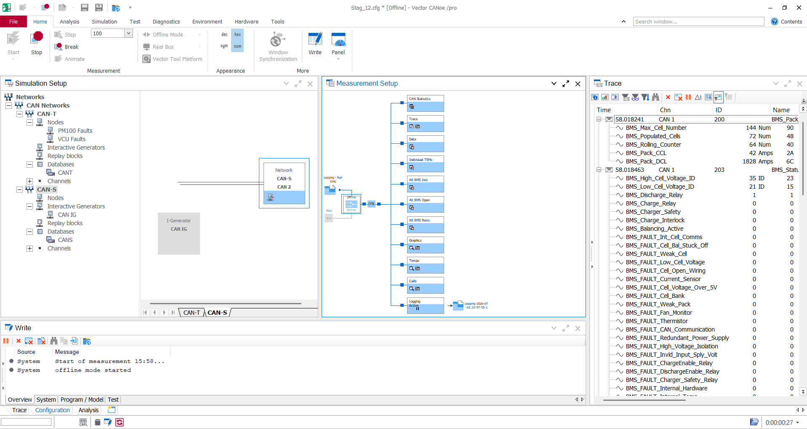
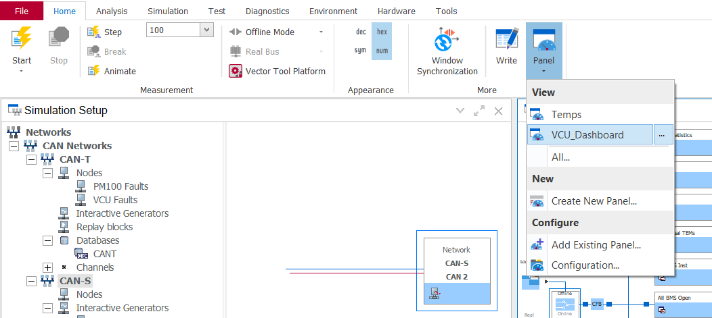
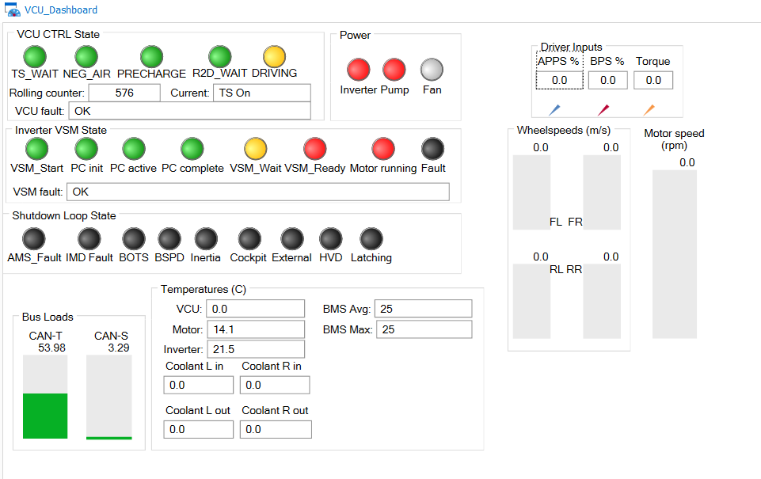
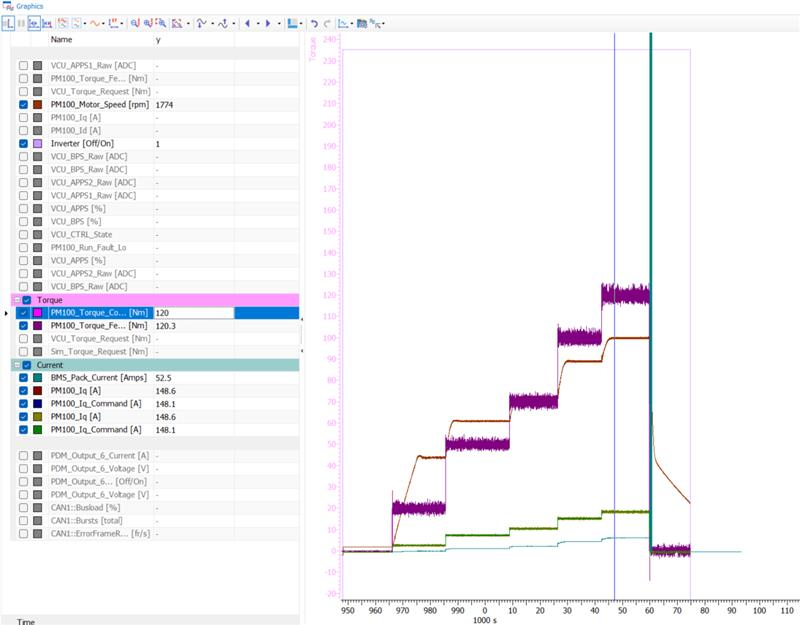
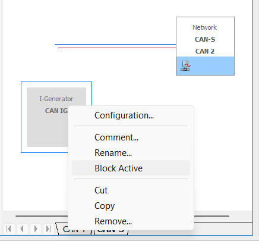
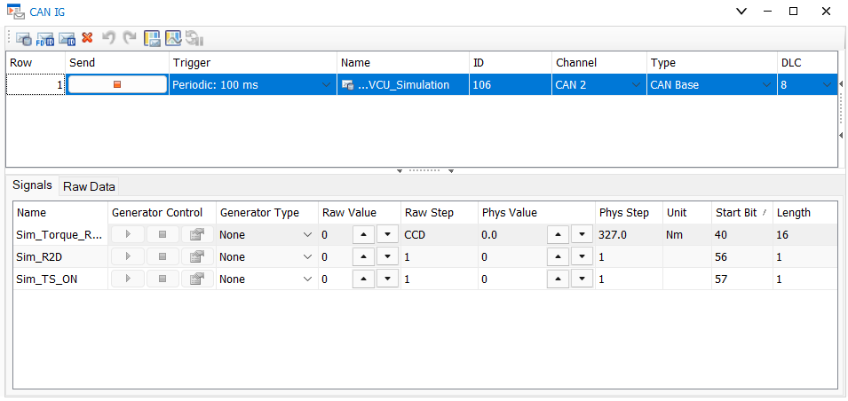

# Testing using Vector CANoe
CANoe is an extremely powerful piece of software for both read-only testing and manipulating the car using its two CAN buses.

This is a rough overview of the ECUs in the car:

With the separated buses:

## Installing
Install a version >=CANoe 19 SP5 (scroll down to the CANoe online installer): <https://www.vector.com/en/product/canoe/>

If you don't already have a license, you'll be able to use the one that's associated with our Vector VN1640A (the 4 channel USB dongle). Try opening the installed software first, if you can't see the license try opening Vector License Client to see more info (with the VN1640A plugged in).

## Opening the workspace
Download a zip of this repository (or use a clone if you already have it cloned), and open `./scripts/canoe/Stag_12.cfg`. When it asks for DBC files, point it to `./src/SUFST/Middlewares/can-defs/dbc/CAN-{T,S}.dbc` respectively. It should only ask you for these once if you save the cfg.

## Overview

All of these windows are fairly useful:
- **Top bar**: Controls what CANoe is currently doing. Note how this is currently on *offline* mode which means this is replaying a log file from disk, rather than using a live CAN bus via a USB dongle.
- **Simulation setup**: Usually you don't need to change much here. It shows you the DBCs associated with each bus, and any associated nodes. A node is anything from a custom CAPL script to an interactive generator (IG).
- **Measurement setup**: A diagram of different visualisation tools connected to the CAN bus, and the ability to set bus settings: switching between online/offline mode, baud rates and replay files
- **Trace**: Live messages on the bus. This is really useful for debugging anything from the car and to verify that interactive generators are working.
- **Write**: Any errors/information

## VCU Stats Panel
If you go to Panels -> VCU_Dashboard, you can see a collated dashboard with stats from the main VCU states.

This is useful to have on a second screen while doing testing to see states/any faults.

## Graphics
CANoe has a very nice system for plotting live data with all kinds of configurable settings (e.g. shared axes/scaling) or plotting one thing vs the other.

The workspace has a few presets, but it's very easy to right click in the measurement setup, add a new graphics panel and make your own from scratch.

## Using the CAN interactive generator for dyno testing
1. Set the car's dash switch to `Remote_Ctrl` mode
2. Connect the Vector VN1640A to the car's umbilical and a reliable PC for testing
3. Make sure you're in *Online mode*, enable the CAN IG (interactive generator) block on CAN-S, hit start on the logging then open the CAN-IG menu (double click and move the window wherever you want)

4. Make sure the VCU Simulation message generator is active (you should see a stop button to show it's running, otherwise you may need to click play)

Then, note the difference between Raw value and Phys (physical) value. You always want to use the Physical column (Raw is the raw, unscaled value sent over CAN).

To turn the car on, it's like pressing the buttons normally. You need to:
- Set `SIM_TS_On` to `1`, wait 0.5s then set it to `0` (you can use the up and down buttons for this on the Phys column)
- Set `SIM_R2D` to `1`, wait 0.5s then set it to `0`

The car should then be in R2D. You can send torque requests manually by leaving Generator type set to None, and stepping up and down the Phys torque request value. Change the generator type for different modes.

If the car isn't responding:
- Make sure you've got everything running and you can see the `VCU_Simulation` message in the Trace window (setting `SIM_TS_On` should show as `1` then `0` in the trace window as you change it)
- Make sure the car is in Remote_Ctrl mode on the dash
- Check for errors on the VCU Dashboard in CANoe or on the dashboard of the car
- If this still doesn't work, try setting the car into a normal mode and doing TS on then R2D normally, even try checking the pedals work if you can
