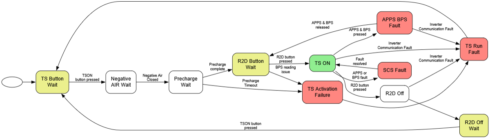

# Code overview
All C sources + header files are inside `src/`. `.c` files are always inside `Src/` and `.h` files are always inside `Inc/`. Almost all of our code is inside `src/SUFST/`, with the exception of some user code blocks for initialisation in `src/Core/`, notably `main.c` and `app_threadx.c`. Everything else is generated by STM32CubeMX based on the IOC in `src/VCU.ioc`.

## Services vs Interfaces vs Functions
The most interesting files in this codebase are:
- `src/SUFST/Src/vcu.c`: Initialisation code for all services
- `src/SUFST/Src/config.c`: Config values used everywhere (lots of calibration, this could get moved into an EEPROM in the future to avoid having to commit this to git)
- `src/SUFST/Src/Services/tick.c`: Main lifecycle state machine

## SUFST Middlewares
This project depends on two submodules:
- [can-defs](https://github.com/sufst/can-defs) - CAN dbc definitions, with generated [cantools](https://github.com/cantools/cantools) C source helpers
- [rtcan](https://github.com/sufst/rtcan) - ThreadX RTOS service for managing concurrent access to CAN peripherals

Both of these are located in `src/SUFST/Middlewares` and added as git submodules.

## STM32CubeMX generation
When you run the generator, make sure you first open the correct ioc, run the generator. If you're making any changes to included components, there's a chance you'll have to manually update the root `Makefile`. You can refer to the generated one in `src/Makefile` to see what to add, although don't just copy it over since this misses out some of our code (e.g. our middlewares). 

# ctrl.c state machine
The main states of the VCU are defined in `ctrl.h`. These are:

```c
typedef enum
{
    CTRL_STATE_TS_BUTTON_WAIT,
    CTRL_STATE_WAIT_NEG_AIR,
    CTRL_STATE_PRECHARGE_WAIT,
    CTRL_STATE_R2D_WAIT,
    CTRL_STATE_TS_ON,
    CTRL_STATE_R2D_OFF,
    CTRL_STATE_R2D_OFF_WAIT,
    CTRL_STATE_TS_ACTIVATION_FAILURE,
    CTRL_STATE_TS_RUN_FAULT,
    CTRL_STATE_SPIN,
    CTRL_STATE_APPS_SCS_FAULT,
    CTRL_STATE_APPS_BPS_FAULT,
} ctrl_state_t;
```

You can read `ctrl.c` to see what happens in each of these states. Below is a rough diagram (although things have slightly changed since the diagram was created, refer to the code directly for an accurate view).


