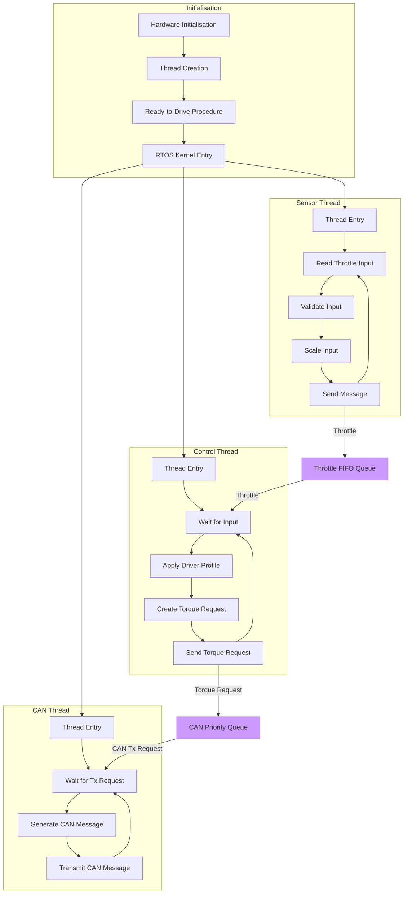

```mermaid
graph TB

    classDef QueueClass fill:#cc99ff,stroke-width:0px;
    
    subgraph Initialisation
        IH[Hardware Initialisation]
        IT[Thread Creation]
        IR[Ready-to-Drive Procedure]
        IK[RTOS Kernel Entry]
        IH --> IT --> IR --> IK
    end
    
    IK --> SE & CE & BE

    subgraph "Sensor Thread&nbsp;&nbsp;&nbsp;&nbsp;&nbsp;&nbsp;&nbsp;&nbsp;&nbsp;&nbsp;&nbsp;&nbsp;&nbsp;&nbsp;&nbsp;&nbsp;&nbsp;&nbsp;"
        SE[Thread Entry]--> SR
        SR[Read Throttle Input]
        SV[Validate Input]
        SS[Scale Input]
        SM[Send Message]
        SR --> SV --> SS --> SM --> SR
    end
  
    subgraph "&nbsp;&nbsp;&nbsp;&nbsp;&nbsp;&nbsp;&nbsp;&nbsp;Control Thread"
        CE[Thread Entry]
        CW[Wait for Input]
        CD[Apply Driver Profile]
        CT[Create Torque Request]
        CM[Send Torque Request]
        CE --> CW --> CD --> CT --> CM --> CW
    end

    subgraph "CAN Thread&nbsp;&nbsp;&nbsp;&nbsp;&nbsp;&nbsp;&nbsp;&nbsp;&nbsp;&nbsp;&nbsp;&nbsp;&nbsp;&nbsp;&nbsp;&nbsp;&nbsp;&nbsp;&nbsp;&nbsp;&nbsp;&nbsp;&nbsp;&nbsp;&nbsp;&nbsp;&nbsp;&nbsp;&nbsp;&nbsp;&nbsp;&nbsp;&nbsp;&nbsp;"
        BE[Thread Entry]
        BW[Wait for Tx Request]
        BG[Generate CAN Message]
        BT[Transmit CAN Message]
        BE --> BW --> BG --> BT --> BW
    end

    SM -- Throttle --> QT
    QT -- Throttle --> CW
    CM -- Torque Request --> QC
    QC -- CAN Tx Request --> BW

    QC[CAN Priority Queue]:::QueueClass
    QT[Throttle FIFO Queue]:::QueueClass
    
```
